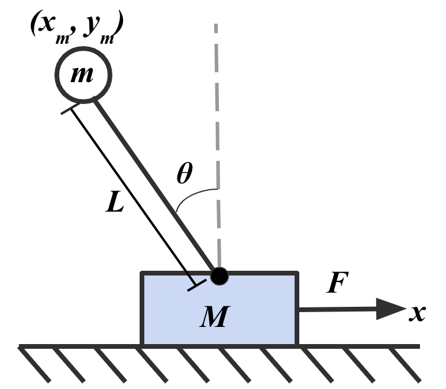

<div align="center">   
  
# PID Optimization Using Lagrangian Mechanics
</div>

<h3 align="center">
  <a href="https://arxiv.org">arXiv</a>
</h3>




## Table of Contents:
1. [Highlights](#high)
2. [News](#news)
3. [Getting Started](#start)
4. [Anaysis](#analysis)
5. [TODO](#todos)
6. [License](#license)
7. [Citation](#citation)
8. [Resource](#resource)

## Highlights <a name="high"></a>

- 🤖 Creating a simulation of a system enables the tuning of control systems without the need for a physical system. In this paper, we employ Lagrangian Mechanics to derive a set of equations to simulate an inverted pendulum on a cart. The system consists of a freely-rotating rod attached to a cart, with the rod’s balance achieved through applying the correct forces to the cart. We manually tune the proportional, integral, and derivative gain coefficients of a Proportional Integral Derivative controller (PID) to balance a rod. To further improve PID performance, we can optimize an objective function to find better gain coefficients.

## News <a name="news"></a>

- **`2023/09`** PID paper is available on arXiv.

## Getting Started <a name="start"></a>

## Analysis <a name="analysis"></a>

## TODO <a name="todos"></a>
- [ ] All configs & checkpoints
- [x] Bug fixes

## License <a name="license"></a>

All assets and code are under the [Apache 2.0 license](./LICENSE) unless specified otherwise.

## Citation <a name="citation"></a>

Please consider citing our paper if the project helps your research with the following BibTex:

```bibtex
```

## Resource

[](https://awesome.re)
